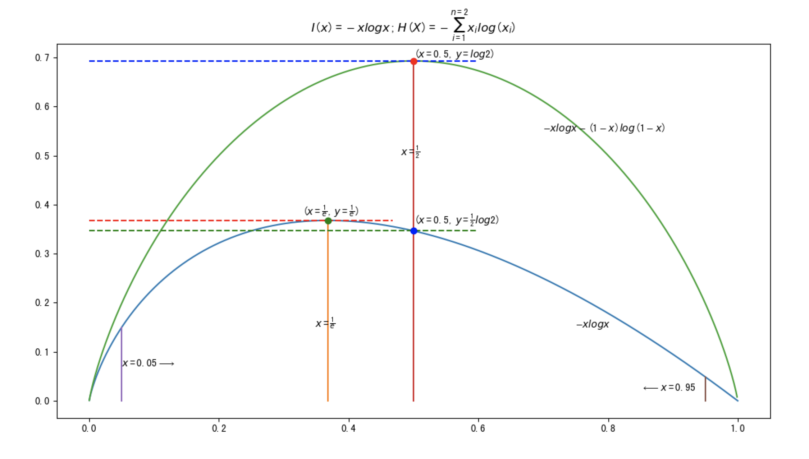

## 损失函数

真实值和预测值的**距离**度量，希望**距离**越小越好。

**距离**空间有很多种，它是泛函分析的基础，在此不作展开。

### 交差熵Cross-Entropy

- 自信量

$I(X)=-log(X)$

- 自信量的期望

$E(I(p_i))=p_iI(p_i)=-p_ilog(p_i)$

- 信息熵

$
H(X)= -\sum_{i=1}^n x_i log(x_i)
$

### MSE 平均平方误差

