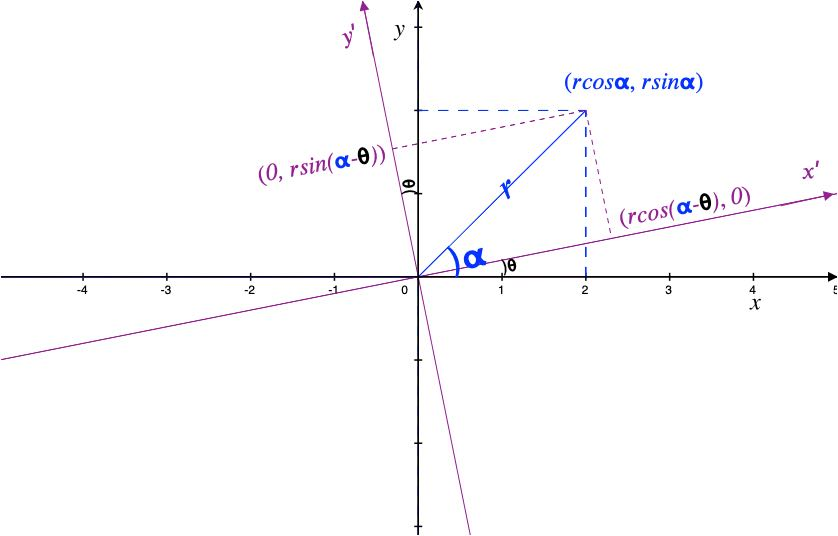

## 正交矩阵
$n \times n$级**实**矩阵$A$，如果满足下列关系，则称其为**正交矩阵**
$$
A'A=E=AA'， \quad A^{-1}=A'
$$

如果把$A$的每一行看作一个基，也就是任意不同的两行之间内积为零，而其自身的$2$范式模长为$1$，对应到坐标系就是直角坐标系的$n$维扩展。

标准的$E$是正交矩阵，非标准的正交矩阵可以理解为$E$的旋转或各轴的取反，例如
$$
\left [ \begin{array}{c} \cos\theta &\sin\theta \\
-\sin\theta &\cos\theta \end{array} \right ]
$$
可以理解为标准二维直角坐标系逆时针旋转了$\theta$角形成的新坐标系(如图，紫色$ox'y'$)。

标准坐标系下任一向量$\overrightarrow{v}$都可表示成$（r\cos\alpha，r\sin\alpha）$的坐标形式， 现保持向量不动，把坐标系逆时针旋转$\theta$角，则它在新坐标系中的坐标也会发生相应的变化，那么它如何变化呢？

## 旋转矩阵
我们左乘一个由上图几何意义得来的正交矩阵试试：
$$
\left [ \begin{array}{c} \cos\theta &\sin\theta \\
-\sin\theta &\cos\theta \end{array} \right ]\left [ \begin{array}{c} r\cos\alpha \\ r\sin\alpha \end{array} \right ]=\left [ \begin{array}{c} r\cos(\alpha-\theta) \\ r\sin(\alpha-\theta) \end{array} \right ]
$$
根据正余弦公式整理，发现结果与几何作图完全吻合， 由此可见，左乘一个这样的**正交矩阵**，其作用效果相当于把标准坐标系旋转了一个角度，而保持测量对象（物理量）不动。

一般称这样的矩阵为**旋转矩阵**

## 镜面反射

然而，并不是任一正交矩阵的作用效果都是旋转，如下
$$
\left [ \begin{array}{c} \cos\theta &\sin\theta \\
\sin\theta & -\cos\theta \end{array} \right ]
$$ 
也是一正交矩阵，仔细观察两个基的变化，它相当于逆时针旋转$\theta$后再把$y'$轴对折，物理上若不对折，无论如何旋转也达不到依运算所得的结果，显然这类正交矩阵既包括旋转还包括了镜面反射。

### 综述
正交矩阵，其作用效果统统可看作是对标准备直角坐标系**$E$**的**旋转**或**旋转加轴反操作**(镜面反射)

具体细分如下：
(根据行列式默认性质：$|A|=|A'|$)
$$AA'=E， \quad |A|^2=1，\quad |A|=±1$$
- $|A|=1$， 时正交矩阵可以理解为坐标系的旋转（总是存在一个角度与之对应的)
- $|A|=-1$， 时，既有旋转也有境面反射，（可能不止一次轴反射）
